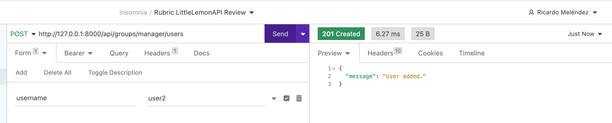

# Little Lemon API Project
This project showcases the development of back-end APIs for the Little Lemon restaurant as part of the Meta Backend Developer Certificate program. The APIs provide functionalities such as user management, menu management, order management, and customer interactions.

# Features
* User authentication (Admin, Manager, Delivery Crew, and Customer)
* Menu browsing and management
* Cart management
* Order placement and management
* Delivery management

# Rubric
## Test if the admin can assign users to the manager group:
Make a POST call to this endpoint http://127.0.0.1:8000/api/groups/manager/users with a valid admin token and a valid username in the HTTP REQUEST body. 

##  Test if you can access the manager group with an admin token:         
Make a GET call to http://127.0.0.1:8000/api/groups/manager/users with an admin token. 

## Test if the admin can add menu items:
Make a POST call to this endpoint http://127.0.0.1:8000/api/menu-items with the admin token and necessary data. Or, log into the Django admin panel as super admin and then browse this endpoint in your browser and add some menu items. 

.png)

## Test if the admin can add categories:
Make a POST call to this endpoint http://127.0.0.1:8000/api/categories with the admin token and necessary data. Or log into the Django admin panel as super admin and then browse this endpoint in your browser and add some menu items.

## Test if the manager can log in:
Make a POST call to this endpoint http://127.0.0.1:8000/auth/token/login/ with the username and password of a manager.

## Test if the manager can update the item of the day:
Make a PATCH call to the endpoint of any single menu item endpoint like this http://127.0.0.1:8000/api/menu-items/1 with a manager token. Add a featured field in the REQUEST body with its value set to true or false. 

## Test if the manager can assign users to the delivery crew:
Make a POST call to this endpoint http://127.0.0.1:8000/api/groups/manager/users with a valid manager token and a valid username in the HTTP REQUEST body. 

## Test if the manager can assign orders to the delivery crew:
Make a PATCH call to an endpoint of any single order item like this http://127.0.0.1:8000/api/orders/1  with a manager token. Add a delivery_crew field in the REQUEST body with its value set to any delivery crew user id.

## Test if the delivery crew can view orders assigned to them:
Make a GET call to this endpoint http://127.0.0.1:8000/api/orders with a delivery crew token.

## Test if the delivery crew can update an order as delivered:
Make a PATCH call to this endpoint to any single order item endpoint like this http://127.0.0.1:8000/api/orders/1  with a delivery crew token. Add a status field in the REQUEST body with its value set to true or false.

## Test if customers can register:
Make a POST call to this endpoint http://127.0.0.1:8000/auth/users/ with a username, password and email in the HTTP REQUEST body.

## Test if customers can log in using their username and password and get access tokens:
Make a POST call to this endpoint http://127.0.0.1:8000/auth/token/login/ with a valid username and password in the HTTP Request body.    

## Test if customers can browse all categories:
Make a GET API call to this endpoint http://127.0.0.1/api/categories with a customer token

## Test if customers can browse all menu items:
Make a GET API call to this endpoint http://127.0.0.1/api/menu-items with a customer token

## Test if customers can browse menu items by category:
Make a GET API call to these endpoints, http://127.0.0.1:8000/api/menu-items?search=Icecream or any available category name instead of Icecream with a customer token.

## Test if customers can paginate menu items:
Make a GET API call to the endpoints http://127.0.0.1:8000/api/menu-items?page=1 or http://127.0.0.1:8000/api/menu-items?page=2 with a customer token.
.png)
.png)

## Test if customers can sort menu items by price:
Make a GET API call to the endpoint http://127.0.0.1:8000/api/menu-items?ordering=price or http://127.0.0.1:8000/api/menu-items?ordering=-price with a customer token.
.png)
.png)

## Test if customers can add menu items to the cart:
Make a POST call to this endpoint http://127.0.0.1:8000/api/cart/menu-items with a customer token. Add these fields with valid data in the REQUEST body for menuitem, unit_price, quantity.

## Test if customers can see previously added items in the cart:
Make a GET call to this endpoint http://127.0.0.1:8000/api/cart/menu-items with a customer token. 

## Test if customers can place orders:
Make a POST call to this endpoint http://127.0.0.1:8000/api/cart/orders with a customer token. Add only the date field with valid data in the REQUEST body. Here is a sample date – 2022-11-16.

## Customers can view their own orders:
Make a GET call to this endpoint http://127.0.0.1:8000/api/cart/orders with a customer token. 

